# MAVEN_MOVIES
DATA ANALYSIS OF MOVIES(CD/DVD) RENTAL (TRANSACTIONS) AND INVENTORY

# Maven Movies Data Analysis: Enhancing Insights for a Rental Business

## Project Overview:
This project analyzes a movie rental business's database to provide actionable insights for improving operations, marketing strategies, and inventory management. The dataset is hosted in the MAVENMOVIES database, and SQL was extensively used for exploratory data analysis (EDA), schema understanding, and answering business-critical ad-hoc queries.

## Project Objectives:

### Customer Insights:

Identify customer details (names, emails) for targeted marketing campaigns.
Analyze customer rental patterns to improve customer engagement.

### Movie Inventory Analysis:

Explore the rental inventory and classify movies based on rental rates and availability.
Provide recommendations for expanding the movie collection based on popularity and rental rates.
Revenue Optimization:

Analyze rental rates to identify trends and the profitability of various pricing categories.
Determine the most rented movie categories and ratings to maximize revenue.

### Operational Efficiency:

Help track and manage movie inventory effectively.
Highlight gaps in the inventory and optimize stock levels.

# Tools & Library Used
[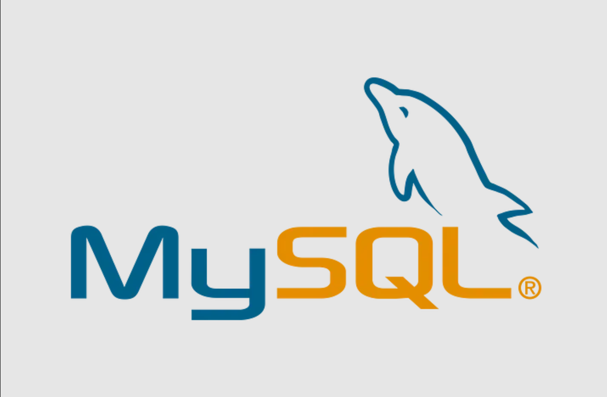](https://www.mysql.com/) &nbsp;

# Project Result

[Click here to get full code](https://github.com/georgerohanjoseph/MAVEN_MOVIES/blob/main/First%20SQL%20-%20Assigment.sql)

# Query Task

Q1. Write an SQL query to display the store id and whether the store is active or inactive.

[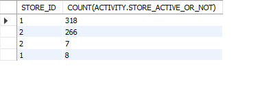](https://www.mysql.com/) &nbsp;

Q2. Write an SQL query to display the total no of rentals per customer.

 &nbsp;

Q3. Write an SQL query to display the name of the movie, its length and categorise the movies according to the length.

[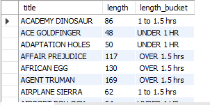](https://www.mysql.com/) &nbsp;

Q4. Write an SQL query to display the inventory id, store id, film name and its description.

[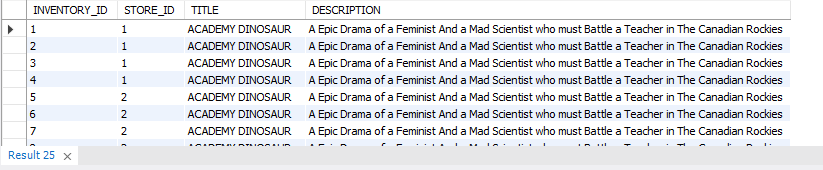](https://www.mysql.com/) &nbsp;

Q5. Write an SQL query to group the films by rating and to display the details of the films with respect to rating.

[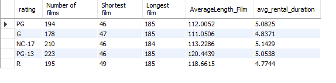](https://www.mysql.com/) &nbsp;

Q6. Write an SQL query to display the name of the film and to describe whether the film can be recommended to the children or not.

[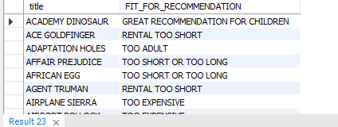](https://www.mysql.com/) &nbsp;

Q7. Write an SQL query to find out the name of the movie and to find its gross revenue.

[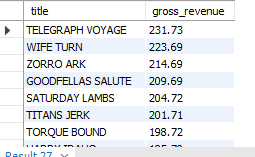](https://www.mysql.com/) &nbsp;

Q8. Write an SQL query to display the store with the highest store revenue.

[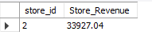](https://www.mysql.com/) &nbsp;

Q9. Write an SQL query to display the details of recent premium customers.

[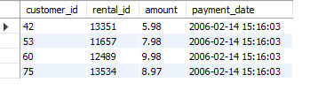](https://www.mysql.com/) &nbsp;

Q10. Write an SQL query to display the details of loyal customers.

[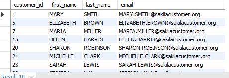](https://www.mysql.com/) &nbsp;

Q11. Write an SQL query to display the month and also the number of rentals in that month.

 &nbsp;

QXII. Write an SQL query to display the movies with behind the scenes.

[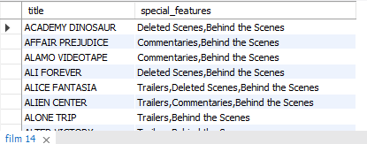](https://www.mysql.com/) &nbsp;

Q13. Write an SQL query to display the no of rentals per customer.

[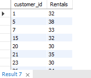](https://www.mysql.com/) &nbsp;

Q14. Write an SQL query to display the payment details of first 100 customers.

[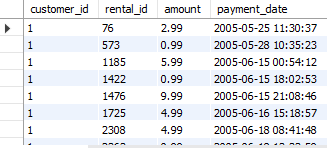](https://www.mysql.com/) &nbsp;

Q15. Write an SQL query to display the film name and its popularity.

[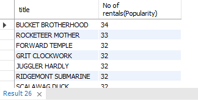](https://www.mysql.com/) &nbsp;

Q16. Write an SQL query to display the rating, rental duration and no. of films per rating.

[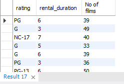](https://www.mysql.com/) &nbsp;

Q17. Write an SQL query to display the number of films based on rating.

[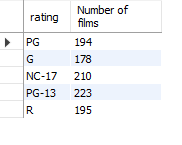](https://www.mysql.com/) &nbsp;

Q18. Write an SQL query to display the rental duration and no of films.

[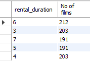](https://www.mysql.com/) &nbsp;

Q19. Write an SQL query to display the replacement cost of a movie.

[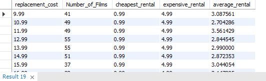](https://www.mysql.com/) &nbsp;

QXX. Write an SQL query to display the person who spent the highest amount.

[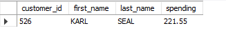](https://www.mysql.com/) &nbsp;

